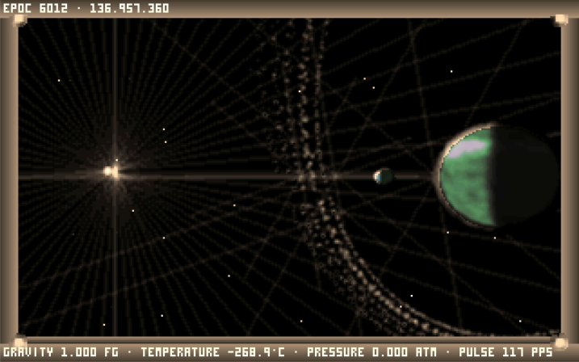

# Noctis IV OM

[](https://github.com/aedmark/Noctis-IV-OM/actions/workflows/linux.yml)

**Noctis IV OM is a hybrid of Noctis IV Plus and Noctis IV LR.** It combines
the native C++ foundation of
[Noctis IV LR](https://github.com/dgcole/noctis-iv-lr) with the feature set and
player-facing identity of Noctis IV Plus.

The goal is to preserve the identity of the Noctis universe—its deterministic
galaxy, worlds, atmosphere, and quiet exploration loop—without requiring DOSBox
for the finished game.

> [!IMPORTANT]
> The native port is under active development and is not yet a complete game.
> Linux is the verified development platform. The Windows preview package builds
> in CI and has started successfully on native Windows and under Wine; its full
> cross-platform compatibility review is not yet complete.



## Current status

The Linux gameplay foundation and agreed Noctis IV Plus feature migration are
complete. Development is moving into the cross-platform compatibility preview;
the Windows preview now has hosted builds plus confirmed native and Wine
startup, while four presentation-hash differences remain under review.

| Area | Status |
| --- | --- |
| Provenance, scope, and baseline | Complete |
| Reproducible Linux build, CI, tests, and preview package | Complete |
| Galaxy and system determinism | Complete |
| Playable native space-flight loop | Complete |
| Native landing and surface exploration | Complete |
| Ship UI, saves, and GOESnet parity | Complete |
| Noctis IV Plus feature migration | Complete on Linux, including Moviemaker |
| Windows build, package, and graphical startup | Complete; presentation review pending |

Compatibility fixtures currently protect all twelve star classes, important
galaxy-generation branches, known DOS-reference stars, FELYSIA's planetary
properties, and its initial surface seeds. See the
[roadmap](docs/porting/ROADMAP.md) for work-package status and evidence.

## Build and run on Linux

Install the Ubuntu dependencies once:

```sh
sudo apt-get update
sudo apt-get install -y clang cmake ninja-build \
  libasound2-dev libx11-dev libxrandr-dev libxi-dev \
  libgl1-mesa-dev libglu1-mesa-dev libxcursor-dev \
  libxinerama-dev
```

Then run the canonical build from the repository root:

```sh
cmake --preset linux-clang-debug
cmake --build --preset linux-clang-debug --parallel
ctest --preset linux-clang-debug --output-on-failure
cd build/linux-clang-debug
./nivlr
```

Do not run `cmake .` or configure from inside `build/`. The preset creates the
correct directory and runtime layout. See the
[complete build guide](BUILDING.md) for GCC, sanitizers, offline builds,
Linux packaging, and Windows CI.

## Diagnostics

The native executable provides a headless preflight report:

```sh
cd build/linux-clang-debug
./nivlr --diagnostics
```

It reports compiler and runtime details, required-resource availability, and
the resolved resource, configuration, player-data, and migration paths as JSON
Lines. It does not open a window or modify runtime data.

Normal builds keep player files outside the build or extracted package. Linux
uses the XDG data/configuration locations; Windows uses Local/Roaming AppData.
To safely copy an older portable profile without launching graphics, run:

```sh
./nivlr --prepare-user-data --migrate-from "/path/to/old Noctis folder"
```

The importer never deletes its source or overwrites an existing destination.
See the [runtime-path and migration contract](docs/porting/RUNTIME_PATHS.md) for
the exact locations and recovery override.

## Repository layout

| Path | Purpose |
| --- | --- |
| `src/` | Active C++20 native port implementation |
| `res/` | Immutable engine runtime resources and assets |
| `data/` | Pinned starmap, guide, and manifest data |
| `docs/` | Porting blueprint, roadmap, decisions, and compatibility test fixtures |
| `doc/` | Port notes, format specifications, and reference images |
| `tests/` | Determinism, journey, and compatibility test suites |
| `cmake/` | CPM package manager, build scripts, and package verification |
| `tools/` | Verification and data utilities |
| `.github/workflows/` | Linux Clang, GCC, ASan, and UBSan CI pipelines |

## Project documentation

- [Porting documentation index](docs/porting/README.md)
- [Architecture and product blueprint](docs/porting/BLUEPRINT.md)
- [Roadmap](docs/porting/ROADMAP.md)
- [Decision log](docs/porting/DECISIONS.md)
- [Provenance and permissions](docs/porting/PROVENANCE.md)
- [Noctis IV Plus feature ledger](docs/porting/NIVPLUS_FEATURE_LEDGER.md)
- [Native build guide](BUILDING.md)
- [Community compatibility-test guide](COMMUNITY_TESTING.md)

## Contributing

Contributions should preserve deterministic universe behavior and include
focused tests or compatibility evidence where appropriate. Start with the
earliest incomplete roadmap item, follow the decisions recorded under
`docs/porting/`, and avoid treating a visual impression as proof of procedural
compatibility.

Before submitting a change, run at least one complete native lane:

```sh
cmake --build --preset linux-clang-debug --parallel
ctest --preset linux-clang-debug --output-on-failure
```

## Credits and license

Noctis IV was created by **Alessandro Ghignola**. This project also incorporates
and preserves work and history from Noctis IV Plus, Noctis IV LR, and their
contributors. See [CONTRIBUTORS.md](CONTRIBUTORS.md) and the
[provenance register](docs/porting/PROVENANCE.md) for details.

The original game and inherited port material are distributed under their
applicable terms, including the WTOF Public License preserved at
[LICENSE.md](LICENSE.md) and base terms in [LICENSE](LICENSE). Third-party
dependencies retain their own licenses.
